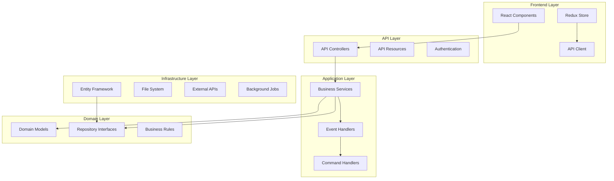
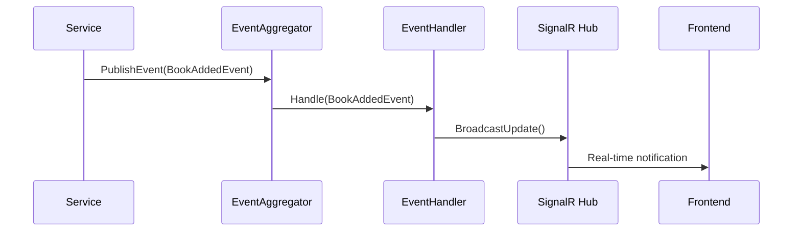
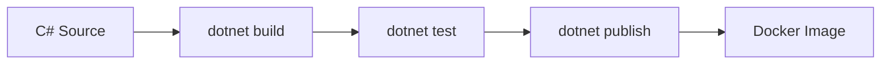
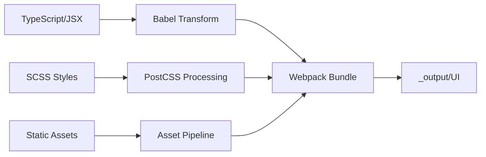
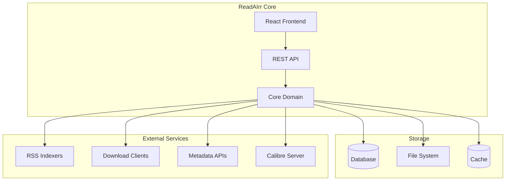

# ReadAIrr Architecture Overview

This document describes the overall architecture and structure of the ReadAIrr application.

## Table of Contents
- [Project Overview](#project-overview)
- [Solution Layout](#solution-layout)
- [Architecture Layers](#architecture-layers)
- [Dependency Injection](#dependency-injection)
- [Event System](#event-system)
- [Build Pipeline](#build-pipeline)
- [Service Boundaries](#service-boundaries)

## Project Overview

ReadAIrr is an ebook and audiobook collection manager built with:
- **.NET 9** backend with ASP.NET Core Web API
- **React 17 + TypeScript** frontend with Redux state management
- **Entity Framework Core** for data access
- **DryIoc** container for dependency injection
- **SignalR** for real-time updates
- **Docker** development and deployment environment

## Solution Layout

The solution is organized into distinct layers and concerns:

### Core Projects
- **`Readarr.Core`** - Domain models, business logic, services
- **`Readarr.Common`** - Shared utilities, extensions, and cross-cutting concerns
- **`Readarr.Host`** - Application startup, configuration, and hosting

### API & Web Layer
- **`Readarr.Api.V1`** - REST API controllers and resources
- **`Readarr.Http`** - HTTP infrastructure, authentication, and middleware
- **`Readarr.SignalR`** - Real-time messaging and notifications

### Platform Specific
- **`Readarr.Windows`** - Windows-specific implementations
- **`Readarr.Mono`** - Cross-platform (Linux/macOS) implementations
- **`Readarr.Console`** - Console application entry point
- **`Readarr.Update`** - Self-update mechanisms

### Test Projects
- **`*.Test`** - Unit tests for each corresponding project
- **`Readarr.Integration.Test`** - End-to-end integration tests
- **`Readarr.Automation.Test`** - UI automation tests
- **`Readarr.Test.Common`** - Shared test utilities and helpers

### Utilities
- **`Readarr.Test.Dummy`** - Minimal test application
- **`ServiceInstall/ServiceUninstall`** - Windows service installation

### Frontend
- **`frontend/src`** - React + TypeScript application
  - Component-based architecture
  - Redux for state management
  - Webpack build system

## Architecture Layers



## Dependency Injection

ReadAIrr uses **DryIoc** as its IoC container, configured in `Startup.cs`:

### Registration Patterns
- **Scoped Services** - Per-request lifetime (API controllers, services)
- **Singleton Services** - Application lifetime (configuration, caching)
- **Transient Services** - Per-resolution (lightweight utilities)

### Key Service Categories
1. **Core Services**
   - `IAuthorService`, `IBookService`, `IEditionService`
   - `IMediaFileService`, `IEBookTagService`
   - `ICalibireProxy` for ebook management

2. **Infrastructure Services**
   - `IMainDatabase`, `ILogDatabase`, `ICacheDatabase`
   - `IEventAggregator` for messaging
   - `IConfigService` for configuration

3. **External Integration Services**
   - Download client implementations
   - Metadata provider services
   - Notification services

### Container Configuration
```csharp
// Example from Startup.cs
services.AddScoped<IAuthorService, AuthorService>();
services.AddScoped<IBookService, BookService>();
services.AddSingleton<IEventAggregator, EventAggregator>();
```

## Event System

ReadAIrr uses an event-driven architecture with `IEventAggregator`:

### Event Types
- **Domain Events** - Core business events (BookAddedEvent, AuthorUpdatedEvent)
- **Integration Events** - External system events (BookImportedEvent)
- **UI Events** - User interface updates via SignalR

### Event Flow


### Key Events
- **Lifecycle Events** - ApplicationStartingEvent, ApplicationStartedEvent
- **Media Events** - BookGrabbedEvent, BookImportedEvent, TrackImportedEvent
- **Management Events** - BookEditedEvent, BookDeletedEvent, AuthorDeletedEvent

## Build Pipeline

### Backend Build (MSBuild)


### Frontend Build (Webpack)


### Build Commands
- **Backend**: `dotnet build src/Readarr.sln`
- **Frontend**: `yarn build` (runs webpack)
- **Full Build**: `./build.sh` (builds both)
- **Development**: `yarn start` (webpack dev server)

## Service Boundaries

### Core Domain Services
- **Author Management** - AuthorService, AuthorRepository
- **Book Management** - BookService, EditionService, BookRepository
- **Media Processing** - MediaFileService, EBookTagService
- **Library Management** - RootFolderService, ImportService

### External Integration Boundaries
- **Download Clients** - SABnzbd, NZBGet, qBittorrent, etc.
- **Indexers** - Newznab, Torznab providers
- **Metadata Providers** - GoodReads, Amazon, etc.
- **Calibre Integration** - CalibreProxy for ebook management

### Infrastructure Boundaries
- **Database Layer** - Entity Framework with SQLite/PostgreSQL
- **File System** - Local and network storage access
- **Caching** - In-memory and distributed caching
- **Logging** - NLog with database targets



## Technology Stack Summary

### Backend Technologies
- **.NET 9** - Runtime and framework
- **ASP.NET Core** - Web framework and hosting
- **Entity Framework Core** - ORM and data access
- **DryIoc** - Dependency injection container
- **NLog** - Logging framework
- **SignalR** - Real-time communication

### Frontend Technologies
- **React 17** - UI framework
- **TypeScript** - Type-safe JavaScript
- **Redux** - State management
- **Webpack 5** - Module bundler and build system
- **Babel** - JavaScript compiler
- **PostCSS** - CSS processing

### Development & Deployment
- **Docker** - Containerization
- **Docker Compose** - Multi-container orchestration
- **GitHub Actions** - CI/CD (planned)
- **Universal CTags** - Code indexing
- **ESLint/Prettier** - Code quality

## Development Guidelines

### Adding New Features
1. **Domain First** - Add models and business logic in Core
2. **API Layer** - Create controllers and resources in Api.V1
3. **Frontend** - Add React components and Redux actions
4. **Tests** - Unit tests for business logic, integration tests for APIs

### Event-Driven Development
- Use events for cross-cutting concerns (logging, notifications)
- Keep event handlers lightweight and focused
- Use SignalR for UI updates that need real-time feedback

### Service Design
- Follow SOLID principles
- Use dependency injection for all external dependencies
- Implement repository pattern for data access
- Separate read and write operations where beneficial

This architecture provides a scalable, maintainable foundation for the ReadAIrr application while supporting both local development and production deployment scenarios.
