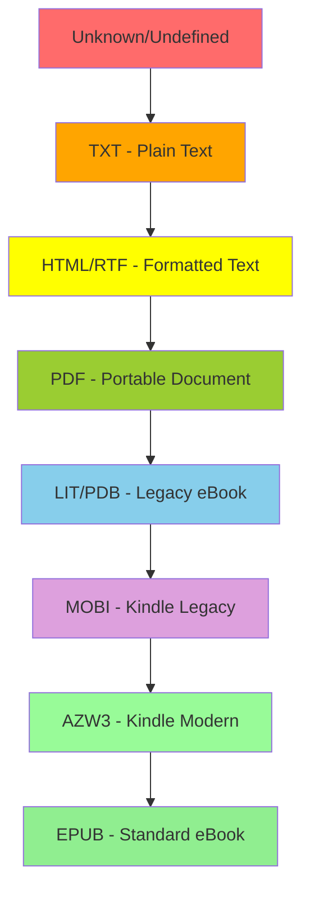
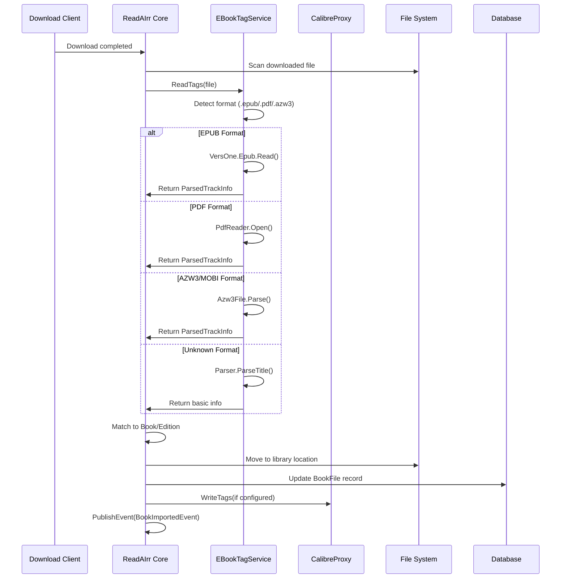
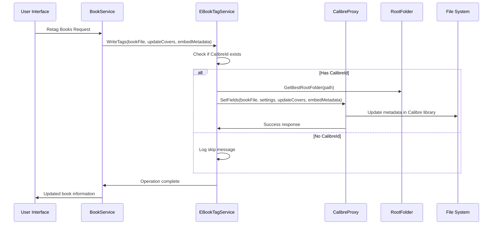
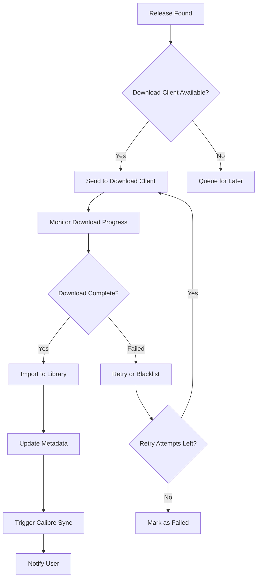
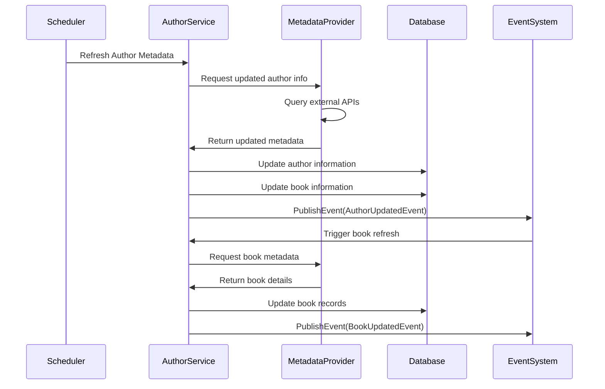
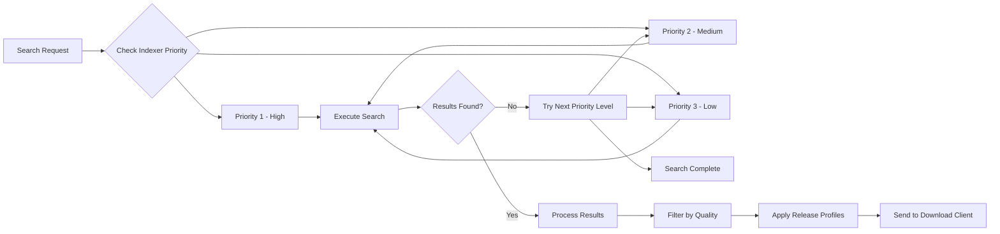
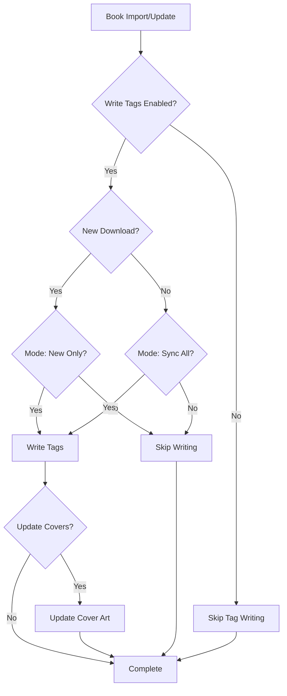

# ReadAIrr Media Processing & External Integrations

This document outlines ReadAIrr's media processing capabilities and external system integrations.

## Table of Contents
- [Supported Media Formats](#supported-media-formats)
- [Media Processing Workflow](#media-processing-workflow)
- [Quality Detection System](#quality-detection-system)
- [External Integrations](#external-integrations)
- [Tag Processing System](#tag-processing-system)
- [Download Client Integration](#download-client-integration)
- [Calibre Integration](#calibre-integration)

## Supported Media Formats

ReadAIrr supports a wide range of ebook and audiobook formats with comprehensive metadata extraction and management capabilities.

### Format Support Matrix

| Format | Extension | Read Tags | Write Tags | Quality Detection | Calibre Support | Notes |
|--------|-----------|-----------|------------|-------------------|-----------------|-------|
| **EPUB** | `.epub`, `.kepub` | ✅ | ✅ | ✅ | ✅ | Full metadata support via VersOne.Epub |
| **AZW3** | `.azw3` | ✅ | ✅ | ✅ | ✅ | Amazon format with DRM-free support |
| **MOBI** | `.mobi` | ✅ | ✅ | ✅ | ✅ | Legacy Kindle format |
| **PDF** | `.pdf` | ✅ | ❌ | ✅ | ✅ | Limited metadata via PdfSharpCore |
| **TXT** | `.txt` | ❌ | ❌ | ✅ | ✅ | Plain text format |
| **RTF** | `.rtf` | ❌ | ❌ | ✅ | ✅ | Rich text format |
| **HTML** | `.html`, `.htm` | ❌ | ❌ | ✅ | ✅ | Web format support |
| **LIT** | `.lit` | ❌ | ❌ | ✅ | ⚠️ | Microsoft Reader (legacy) |
| **PDB** | `.pdb` | ❌ | ❌ | ✅ | ⚠️ | Palm Database format |

### Quality Hierarchy

ReadAIrr uses a quality hierarchy system for format preferences:



## Media Processing Workflow

### Book Import Process



### Tag Synchronization Process



## Quality Detection System

### Quality Detection Sources

1. **TagLib Detection** - Primary method using embedded metadata
2. **Extension Detection** - Fallback based on file extension
3. **Content Analysis** - Deep inspection for ambiguous files

### Detection Implementation

```typescript
// Quality detection logic from EBookTagService.cs
public ParsedTrackInfo ReadTags(IFileInfo file)
{
    var extension = file.Extension.ToLower();
    
    switch (extension)
    {
        case ".pdf":
            return ReadPdf(file.FullName);
        case ".epub":
        case ".kepub":
            return ReadEpub(file.FullName);
        case ".azw3":
        case ".mobi":
            return ReadAzw3(file.FullName);
        default:
            return Parser.Parser.ParseTitle(file.FullName);
    }
}
```

### Quality Definitions

| Quality | Typical Size | Use Case | Priority |
|---------|-------------|----------|----------|
| **EPUB** | 1-5 MB | Standard ebooks, best compatibility | Highest |
| **AZW3** | 1-8 MB | Kindle-optimized with enhanced features | High |
| **MOBI** | 2-6 MB | Legacy Kindle devices | Medium |
| **PDF** | 5-50 MB | Fixed layout, academic texts | Medium |
| **TXT** | 100KB-1MB | Plain text, minimal formatting | Low |

## External Integrations

### Calibre Content Server Integration

ReadAIrr provides comprehensive integration with Calibre Content Server for professional ebook management.

#### Calibre Features
- **Library Management** - Add/remove books from Calibre database
- **Format Conversion** - Automatic format conversion via Calibre
- **Metadata Sync** - Bidirectional metadata synchronization
- **Cover Management** - Cover image updates and synchronization
- **Custom Columns** - Support for Calibre custom columns
- **Virtual Libraries** - Integration with Calibre virtual library system

#### Configuration Options
```json
{
  "host": "calibre.example.com",
  "port": 8080,
  "username": "readairr",
  "password": "secure_password",
  "library": "Main Library",
  "urlBase": "/calibre",
  "useSsl": true,
  "outputFormat": "EPUB",
  "outputProfile": "tablet",
  "convertToFormat": true
}
```

### Download Client Integration

ReadAIrr supports multiple download clients for automated book acquisition.

#### Supported Download Clients

| Client | Protocol | Features | Status |
|--------|----------|----------|--------|
| **SABnzbd** | Usenet | Categories, priorities, post-processing | ✅ Full |
| **NZBGet** | Usenet | Scripting, categories, RSS | ✅ Full |
| **qBittorrent** | BitTorrent | WebUI API, categories, tags | ✅ Full |
| **Deluge** | BitTorrent | WebUI/Daemon API, labels | ✅ Full |
| **rTorrent** | BitTorrent | XMLRPC API, custom ratios | ✅ Full |
| **Transmission** | BitTorrent | RPC API, bandwidth management | ✅ Full |
| **uTorrent** | BitTorrent | WebAPI, labels, priorities | ⚠️ Limited |
| **Download Station** | Both | Synology NAS integration | ✅ Full |

#### Download Client Workflow



### Metadata Provider Integration

#### Primary Metadata Sources
- **Goodreads** - Primary source for book metadata
- **Amazon** - ASIN-based lookups for Kindle content
- **Google Books** - ISBN-based metadata
- **Open Library** - Open-source book database
- **WorldCat** - Library catalog integration

#### Metadata Refresh Process



### Indexer Integration

ReadAIrr supports both Usenet indexers and BitTorrent trackers.

#### Indexer Types

| Type | Protocol | Authentication | Features |
|------|----------|----------------|-----------|
| **Newznab** | Usenet | API Key | RSS, Search, Categories |
| **Torznab** | BitTorrent | API Key | RSS, Search, Categories |
| **Generic Torrent** | BitTorrent | None/Cookie | RSS feeds only |
| **Private Trackers** | BitTorrent | Passkey/Cookie | Enhanced metadata |

#### Search Priority System



## Tag Processing System

### Metadata Tag Mapping

ReadAIrr maintains a comprehensive mapping between internal metadata and external format specifications.

#### EPUB Metadata Mapping

| ReadAIrr Field | EPUB DC Element | EPUB Meta Property | Notes |
|----------------|-----------------|-------------------|-------|
| `Title` | `dc:title` | - | Primary title |
| `Authors` | `dc:creator` | - | Creator list |
| `Publisher` | `dc:publisher` | - | Publisher name |
| `Language` | `dc:language` | - | Language code |
| `Isbn` | `dc:identifier` | `scheme="isbn"` | ISBN identification |
| `Asin` | `dc:identifier` | `scheme="asin"` | Amazon ASIN |
| `SeriesTitle` | - | `calibre:series` | Series information |
| `SeriesIndex` | - | `calibre:series_index` | Series position |
| `ReleaseDate` | `dc:date` | - | Publication date |

#### PDF Metadata Mapping

| ReadAIrr Field | PDF Info Key | XMP Property | Notes |
|----------------|--------------|--------------|-------|
| `Title` | `Title` | `dc:title` | Document title |
| `Authors` | `Author` | `dc:creator` | Creator information |
| `Subject` | `Subject` | `dc:subject` | Document subject |
| `Keywords` | `Keywords` | `pdf:Keywords` | Keyword tags |
| `Creator` | `Creator` | `xmp:CreatorTool` | Creation application |
| `Producer` | `Producer` | `pdf:Producer` | PDF generator |

### Tag Write Operations

ReadAIrr supports three tag writing modes:

1. **Never** - No tag writing (preserve original metadata)
2. **New Downloads Only** - Tag newly imported files only
3. **All Files (Sync)** - Keep all files synchronized with database

#### Tag Write Configuration



## Performance Considerations

### Caching Strategy
- **Metadata Cache** - 24-hour cache for external API responses
- **Quality Cache** - Persistent quality detection results
- **Cover Cache** - Local cover image storage
- **Search Cache** - Temporary search result caching

### Processing Optimization
- **Batch Operations** - Process multiple files simultaneously
- **Lazy Loading** - Load metadata on demand
- **Background Tasks** - Non-blocking metadata updates
- **Rate Limiting** - Respect external API limits

### Storage Efficiency
- **Hard Linking** - Preserve disk space for duplicates
- **Compression** - Automatic archive extraction
- **Cleanup Tasks** - Remove orphaned files and metadata
- **Database Optimization** - Regular VACUUM and ANALYZE operations

This comprehensive media processing system enables ReadAIrr to handle diverse ebook formats while maintaining high-quality metadata and seamless integration with external systems like Calibre and various download clients.
