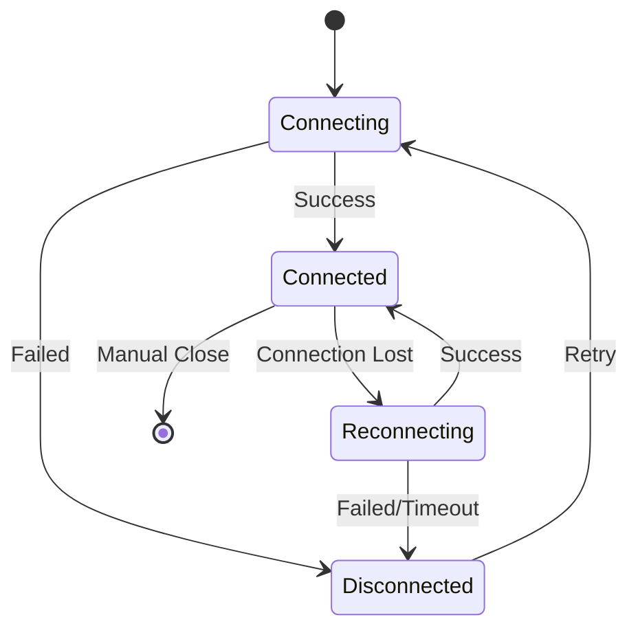

# ReadAIrr SignalR Documentation

This document describes ReadAIrr's real-time SignalR messaging system for live updates and notifications.

## Table of Contents
- [Overview](#overview)
- [Connection Setup](#connection-setup)
- [Message Format](#message-format)
- [Hub Messages](#hub-messages)
- [Client Integration](#client-integration)
- [Authentication](#authentication)
- [Error Handling](#error-handling)

## Overview

ReadAIrr uses Microsoft SignalR to provide real-time updates to connected clients. The system broadcasts changes to resources, command status updates, system health information, and other events as they occur.

### SignalR Configuration
- **Hub Endpoint**: `/signalr/messages`
- **Protocol**: JSON
- **Authentication**: API Key via query parameter or JWT
- **Reconnection**: Automatic with exponential backoff
- **Transport**: WebSocket (preferred), Server-Sent Events, Long Polling

## Connection Setup

### Hub Connection URL
```javascript
const hubUrl = `${baseUrl}/signalr/messages?access_token=${encodeURIComponent(apiKey)}`;
```

### JavaScript Client Setup
```javascript
import * as signalR from '@microsoft/signalr';

const connection = new signalR.HubConnectionBuilder()
  .withUrl(hubUrl)
  .configureLogging(signalR.LogLevel.Information)
  .withAutomaticReconnect({
    nextRetryDelayInMilliseconds: (retryContext) => {
      if (retryContext.elapsedMilliseconds > 180000) {
        // Mark as disconnected after 3 minutes
        return null;
      }
      return Math.min(retryContext.previousRetryCount, 10) * 1000;
    }
  })
  .build();

// Event handlers
connection.onreconnecting(() => console.log('SignalR reconnecting...'));
connection.onreconnected(() => console.log('SignalR reconnected'));
connection.onclose(() => console.log('SignalR connection closed'));

// Message handler
connection.on('receiveMessage', (message) => {
  console.log('Received:', message.name, message.body);
  handleSignalRMessage(message);
});

// Start connection
await connection.start();
```

## Message Format

All SignalR messages follow a consistent format:

### SignalRMessage Structure
```typescript
interface SignalRMessage {
  name: string;        // Message type identifier
  body: any;          // Message payload (varies by type)
  action?: string;    // Action type (updated, deleted, sync)
}
```

### Common Actions
- `updated` - Resource has been modified
- `deleted` - Resource has been removed
- `sync` - Full synchronization required

## Hub Messages

### System Messages

#### Version Information
Sent when a client connects to provide version information.

```typescript
// Message Name: "version"
interface VersionMessage {
  name: "version";
  body: {
    version: string; // e.g., "11.0.0.1234"
  };
}
```

**Example:**
```json
{
  "name": "version",
  "body": {
    "version": "11.0.0.1234"
  }
}
```

### Resource Update Messages

#### Author Updates
Broadcast when author information changes.

```typescript
// Message Name: "author"
interface AuthorMessage {
  name: "author";
  body: {
    action: "updated" | "deleted";
    resource: AuthorResource;
  };
}
```

**Example:**
```json
{
  "name": "author",
  "body": {
    "action": "updated",
    "resource": {
      "id": 1,
      "authorName": "Stephen King",
      "monitored": true,
      "statistics": {
        "bookCount": 54,
        "bookFileCount": 52
      }
    }
  }
}
```

#### Book Updates
Broadcast when book information changes.

```typescript
// Message Name: "book"
interface BookMessage {
  name: "book";
  body: {
    action: "updated" | "deleted";
    resource: BookResource;
  };
}
```

**Example:**
```json
{
  "name": "book",
  "body": {
    "action": "updated",
    "resource": {
      "id": 123,
      "title": "The Shining",
      "monitored": true,
      "grabbed": false,
      "hasFile": true
    }
  }
}
```

#### Book File Updates
Broadcast when book files are added, updated, or deleted.

```typescript
// Message Name: "bookfile"
interface BookFileMessage {
  name: "bookfile";
  body: {
    action: "updated" | "deleted";
    resource: BookFileResource;
  };
}
```

**Example:**
```json
{
  "name": "bookfile",
  "body": {
    "action": "updated",
    "resource": {
      "id": 456,
      "bookId": 123,
      "authorId": 1,
      "path": "/books/Stephen King/The Shining.epub",
      "quality": {
        "quality": {
          "id": 10,
          "name": "EPUB"
        }
      }
    }
  }
}
```

### Command and Task Messages

#### Command Updates
Broadcast command execution status and progress.

```typescript
// Message Name: "command"
interface CommandMessage {
  name: "command";
  body: {
    action: "updated" | "sync";
    resource?: CommandResource;
  };
}
```

**Example:**
```json
{
  "name": "command",
  "body": {
    "action": "updated",
    "resource": {
      "id": 789,
      "name": "RefreshAuthor",
      "status": "completed",
      "queued": "2024-09-01T19:23:34Z",
      "started": "2024-09-01T19:23:35Z",
      "ended": "2024-09-01T19:24:12Z",
      "duration": "00:00:37",
      "message": "Completed successfully"
    }
  }
}
```

#### System Task Updates
Broadcast scheduled task status changes.

```typescript
// Message Name: "systemtask"
interface SystemTaskMessage {
  name: "systemtask";
  body: {
    action: "updated";
    resource: TaskResource;
  };
}
```

### Queue and Download Messages

#### Queue Updates
Broadcast download queue changes.

```typescript
// Message Name: "queue"
interface QueueMessage {
  name: "queue";
  body: {
    action: "updated" | "deleted";
    resource: QueueResource;
  };
}
```

**Example:**
```json
{
  "name": "queue",
  "body": {
    "action": "updated",
    "resource": {
      "id": 101,
      "title": "The Stand",
      "status": "downloading",
      "sizeleft": 1048576,
      "timeleft": "00:02:30",
      "downloadId": "abc123"
    }
  }
}
```

#### Queue Status Updates
Broadcast overall queue status information.

```typescript
// Message Name: "queuestatus"
interface QueueStatusMessage {
  name: "queuestatus";
  body: {
    resource: {
      totalCount: number;
      count: number;
      unknownCount: number;
      errors: boolean;
      warnings: boolean;
    };
  };
}
```

### System Health Messages

#### Health Check Updates
Broadcast system health status changes.

```typescript
// Message Name: "health"
interface HealthMessage {
  name: "health";
  body: {
    action: "updated";
    resource: HealthCheckResource[];
  };
}
```

**Example:**
```json
{
  "name": "health",
  "body": {
    "action": "updated",
    "resource": [
      {
        "type": "warning",
        "message": "No download clients available",
        "wikiUrl": "https://readairr.github.io/docs/settings/download-clients"
      }
    ]
  }
}
```

### Calendar and Wanted Updates

#### Calendar Updates
Broadcast calendar event changes.

```typescript
// Message Name: "calendar"
interface CalendarMessage {
  name: "calendar";
  body: {
    action: "updated";
    resource: CalendarResource;
  };
}
```

#### Wanted List Updates
Broadcast changes to wanted/missing books.

```typescript
// Message Name: "wantedcutoff" | "wantedmissing"
interface WantedMessage {
  name: "wantedcutoff" | "wantedmissing";
  body: {
    action: "updated";
    resource: BookResource;
  };
}
```

### Configuration Messages

#### Quality Definition Updates
Broadcast quality definition changes.

```typescript
// Message Name: "qualitydefinition"
interface QualityDefinitionMessage {
  name: "qualitydefinition";
  body: {
    action: "updated" | "sync";
    resource?: QualityDefinitionResource[];
  };
}
```

#### Root Folder Updates
Broadcast root folder configuration changes.

```typescript
// Message Name: "rootfolder"
interface RootFolderMessage {
  name: "rootfolder";
  body: {
    action: "updated";
    resource: RootFolderResource;
  };
}
```

#### Tag Updates
Broadcast tag management changes.

```typescript
// Message Name: "tag"
interface TagMessage {
  name: "tag";
  body: {
    action: "sync";
  };
}
```

## Client Integration

### Message Handler Pattern

```javascript
function handleSignalRMessage(message) {
  const { name, body } = message;
  
  // Convert message name to handler function name
  const handlerName = `handle${titleCase(name)}`;
  
  if (typeof this[handlerName] === 'function') {
    this[handlerName](body);
  } else {
    console.warn(`No handler found for message: ${name}`);
  }
}

// Example handlers
function handleAuthor(body) {
  if (body.action === 'updated') {
    updateAuthorInStore(body.resource);
  } else if (body.action === 'deleted') {
    removeAuthorFromStore(body.resource.id);
  }
}

function handleCommand(body) {
  if (body.action === 'sync') {
    refreshAllCommands();
  } else if (body.resource) {
    updateCommandInStore(body.resource);
  }
}
```

### React Integration Example

```javascript
import { useEffect, useCallback } from 'react';
import { useDispatch } from 'react-redux';
import * as signalR from '@microsoft/signalr';

function useSignalRConnection(apiKey, baseUrl) {
  const dispatch = useDispatch();
  
  const handleMessage = useCallback((message) => {
    switch (message.name) {
      case 'author':
        if (message.body.action === 'updated') {
          dispatch(updateAuthor(message.body.resource));
        }
        break;
        
      case 'book':
        if (message.body.action === 'updated') {
          dispatch(updateBook(message.body.resource));
        }
        break;
        
      case 'command':
        if (message.body.action === 'updated') {
          dispatch(updateCommand(message.body.resource));
        }
        break;
        
      default:
        console.log(`Unhandled SignalR message: ${message.name}`);
    }
  }, [dispatch]);
  
  useEffect(() => {
    const connection = new signalR.HubConnectionBuilder()
      .withUrl(`${baseUrl}/signalr/messages?access_token=${encodeURIComponent(apiKey)}`)
      .withAutomaticReconnect()
      .build();
    
    connection.on('receiveMessage', handleMessage);
    
    connection.start().then(() => {
      console.log('SignalR connected');
    }).catch(err => {
      console.error('SignalR connection failed:', err);
    });
    
    return () => {
      connection.stop();
    };
  }, [apiKey, baseUrl, handleMessage]);
}
```

## Authentication

### API Key Authentication
SignalR connections are authenticated using the same API key as REST API calls.

**Query Parameter Method:**
```javascript
const url = `${baseUrl}/signalr/messages?access_token=${encodeURIComponent(apiKey)}`;
```

### Authorization Policy
The SignalR hub requires the "SignalR" authorization policy, which validates the API key and ensures the user has appropriate permissions.

## Error Handling

### Connection Errors

```javascript
connection.onclose((error) => {
  if (error) {
    console.error('SignalR connection closed with error:', error);
  } else {
    console.log('SignalR connection closed gracefully');
  }
  
  // Handle reconnection or show disconnected state
  showDisconnectedState();
});
```

### Reconnection Strategy

```javascript
connection.onreconnecting((error) => {
  console.log('SignalR reconnecting...', error);
  showReconnectingState();
});

connection.onreconnected((connectionId) => {
  console.log('SignalR reconnected with ID:', connectionId);
  
  // Refresh data after reconnection
  refreshApplicationData();
  showConnectedState();
});
```

### Message Processing Errors

```javascript
connection.on('receiveMessage', (message) => {
  try {
    handleSignalRMessage(message);
  } catch (error) {
    console.error('Error processing SignalR message:', error, message);
    
    // Log to external service for monitoring
    logError('signalr-message-processing', error, { message });
  }
});
```

## Connection Lifecycle

### Connection States



### State Management

```javascript
const connectionState = {
  isConnected: false,
  isReconnecting: false,
  isDisconnected: false,
  connectionId: null,
  error: null
};

function updateConnectionState(newState) {
  Object.assign(connectionState, newState);
  notifyStateChange(connectionState);
}

connection.onconnected = (connectionId) => {
  updateConnectionState({
    isConnected: true,
    isReconnecting: false,
    isDisconnected: false,
    connectionId,
    error: null
  });
};
```

## Performance Considerations

### Message Batching
SignalR messages are debounced on the server side to prevent flooding clients with rapid updates:

- **Debounce Time**: 100ms
- **Batch Size**: Up to 50 messages per batch
- **Priority**: Critical messages bypass batching

### Resource Updates
To optimize performance, resource updates include only changed fields when possible, though full resources are typically sent for simplicity.

### Client-Side Optimizations

```javascript
// Throttle UI updates to prevent excessive renders
const throttledUIUpdate = throttle((updates) => {
  batchUpdateUI(updates);
}, 100);

// Batch multiple updates together
const pendingUpdates = new Map();

function handleResourceUpdate(resource) {
  pendingUpdates.set(resource.id, resource);
  throttledUIUpdate(Array.from(pendingUpdates.values()));
}
```

This SignalR system enables ReadAIrr clients to provide real-time feedback and updates, creating a responsive and interactive user experience for library management activities.
