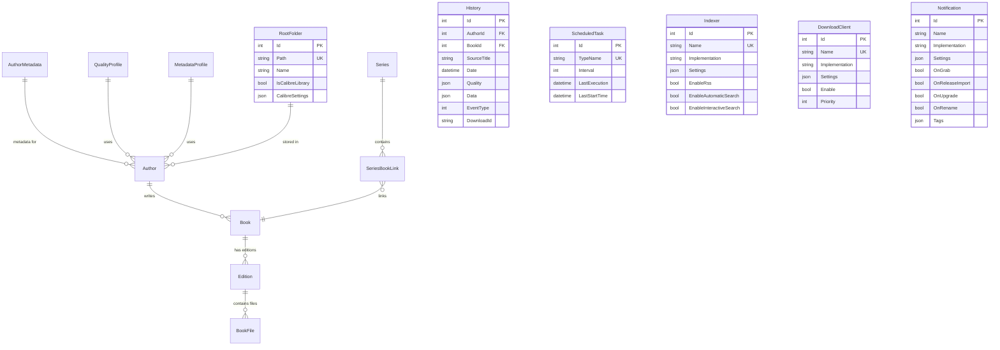

# ReadAIrr Database Schema

ReadAIrr uses a custom ORM built on top of Dapper for data access, with support for both SQLite (default) and PostgreSQL databases.

## Table of Contents
- [Architecture Overview](#architecture-overview)
- [Core Entities](#core-entities)
- [Relationship Diagrams](#relationship-diagrams)
- [Table Definitions](#table-definitions)
- [Database Migrations](#database-migrations)
- [Indexes and Performance](#indexes-and-performance)

## Architecture Overview

The database schema follows a normalized design optimized for book/ebook collection management:

- **Authors & Books**: Hierarchical metadata structure
- **Editions**: Multiple editions per book (paperback, hardcover, ebook, etc.)
- **BookFiles**: Physical/digital files linked to editions
- **Media Management**: Quality profiles, root folders, and Calibre integration
- **Activity Tracking**: History, logs, and background tasks
- **External Integration**: Download clients, indexers, and notifications

### Database Technologies
- **Default**: SQLite with WAL mode for single-user scenarios
- **Alternative**: PostgreSQL for multi-user or high-performance deployments
- **ORM**: Custom repository pattern with Dapper
- **Migrations**: Version-controlled schema updates

## Core Entities

### Primary Content Hierarchy

### Series Management

## Relationship Diagrams

### Complete Entity Relationships

## Table Definitions

### Core Content Tables

#### AuthorMetadata
Central author information from external metadata sources.

| Column | Type | Constraints | Description |
|--------|------|-------------|-------------|
| `Id` | INTEGER | PRIMARY KEY | Internal identifier |
| `ForeignAuthorId` | TEXT | UNIQUE, NOT NULL | External metadata ID (GoodReads, etc.) |
| `TitleSlug` | TEXT | UNIQUE | URL-friendly name |
| `Name` | TEXT | NOT NULL | Author's name |
| `Overview` | TEXT | | Author biography |
| `Disambiguation` | TEXT | | Disambiguation text |
| `Gender` | TEXT | | Author's gender |
| `Hometown` | TEXT | | Author's hometown |
| `Born` | DATETIME | | Birth date |
| `Died` | DATETIME | | Death date |
| `Status` | INTEGER | | Author status (continuing/ended) |
| `Images` | TEXT | | JSON array of cover images |
| `Links` | TEXT | | JSON array of external links |
| `Genres` | TEXT | | JSON array of genres |
| `Ratings` | TEXT | | JSON ratings object |
| `Aliases` | TEXT | DEFAULT '[]' | JSON array of alternate names |

#### Author
ReadAIrr-specific author configuration and monitoring settings.

| Column | Type | Constraints | Description |
|--------|------|-------------|-------------|
| `Id` | INTEGER | PRIMARY KEY | Internal identifier |
| `AuthorMetadataId` | INTEGER | UNIQUE, FK | Reference to AuthorMetadata |
| `CleanName` | TEXT | INDEXED | Normalized name for searching |
| `Path` | TEXT | INDEXED | Local file system path |
| `Monitored` | BOOLEAN | | Monitor for new releases |
| `LastInfoSync` | DATETIME | | Last metadata refresh |
| `SortName` | TEXT | | Name for sorting purposes |
| `QualityProfileId` | INTEGER | FK | Quality settings |
| `MetadataProfileId` | INTEGER | FK | Metadata filtering rules |
| `Tags` | TEXT | | JSON array of tags |
| `Added` | DATETIME | | Date added to library |
| `AddOptions` | TEXT | | JSON add options |

#### Book
Book metadata and monitoring configuration.

| Column | Type | Constraints | Description |
|--------|------|-------------|-------------|
| `Id` | INTEGER | PRIMARY KEY | Internal identifier |
| `AuthorMetadataId` | INTEGER | FK | Reference to AuthorMetadata |
| `ForeignBookId` | TEXT | INDEXED | External book ID |
| `TitleSlug` | TEXT | UNIQUE | URL-friendly title |
| `Title` | TEXT | NOT NULL | Book title |
| `ReleaseDate` | DATETIME | | Original publication date |
| `Links` | TEXT | | JSON array of external links |
| `Genres` | TEXT | | JSON array of genres |
| `Ratings` | TEXT | | JSON ratings object |
| `CleanTitle` | TEXT | INDEXED | Normalized title for searching |
| `Monitored` | BOOLEAN | | Monitor for releases |
| `AnyEditionOk` | BOOLEAN | | Accept any edition |
| `LastInfoSync` | DATETIME | | Last metadata refresh |
| `Added` | DATETIME | | Date added to library |
| `AddOptions` | TEXT | | JSON add options |

#### Edition
Specific editions/formats of books.

| Column | Type | Constraints | Description |
|--------|------|-------------|-------------|
| `Id` | INTEGER | PRIMARY KEY | Internal identifier |
| `BookId` | INTEGER | FK | Reference to Book |
| `ForeignEditionId` | TEXT | UNIQUE | External edition ID |
| `Isbn13` | TEXT | | ISBN-13 identifier |
| `Asin` | TEXT | | Amazon ASIN |
| `Title` | TEXT | NOT NULL | Edition title |
| `TitleSlug` | TEXT | | URL-friendly title |
| `Language` | TEXT | | Language code |
| `Overview` | TEXT | | Edition description |
| `Format` | TEXT | | Format (Hardcover, Paperback, etc.) |
| `IsEbook` | BOOLEAN | | Is electronic format |
| `Disambiguation` | TEXT | | Disambiguation text |
| `Publisher` | TEXT | | Publisher name |
| `PageCount` | INTEGER | | Number of pages |
| `ReleaseDate` | DATETIME | | Edition release date |
| `Images` | TEXT | | JSON array of cover images |
| `Links` | TEXT | | JSON array of external links |
| `Ratings` | TEXT | | JSON ratings object |
| `Monitored` | BOOLEAN | | Monitor this edition |
| `ManualAdd` | BOOLEAN | | Manually added edition |

#### BookFile
Physical or digital files associated with editions.

| Column | Type | Constraints | Description |
|--------|------|-------------|-------------|
| `Id` | INTEGER | PRIMARY KEY | Internal identifier |
| `EditionId` | INTEGER | INDEXED, FK | Reference to Edition |
| `CalibreId` | INTEGER | | Calibre database ID |
| `Quality` | TEXT | | JSON quality information |
| `Size` | INTEGER | | File size in bytes |
| `SceneName` | TEXT | | Original scene release name |
| `DateAdded` | DATETIME | NOT NULL | Date file was added |
| `ReleaseGroup` | TEXT | | Release group name |
| `MediaInfo` | TEXT | | JSON media information |
| `Modified` | DATETIME | DEFAULT | File modification time |
| `Path` | TEXT | UNIQUE, NOT NULL | File system path |

### Configuration Tables

#### QualityProfile
Quality settings and preferences for file formats.

| Column | Type | Constraints | Description |
|--------|------|-------------|-------------|
| `Id` | INTEGER | PRIMARY KEY | Internal identifier |
| `Name` | TEXT | UNIQUE | Profile name |
| `Cutoff` | INTEGER | | Quality cutoff level |
| `Items` | TEXT | NOT NULL | JSON quality items |
| `UpgradeAllowed` | BOOLEAN | | Allow quality upgrades |

#### MetadataProfile
Filtering rules for metadata and editions.

| Column | Type | Constraints | Description |
|--------|------|-------------|-------------|
| `Id` | INTEGER | PRIMARY KEY | Internal identifier |
| `Name` | TEXT | UNIQUE | Profile name |
| `MinPopularity` | REAL | | Minimum popularity threshold |
| `SkipMissingDate` | BOOLEAN | | Skip books without release date |
| `SkipMissingIsbn` | BOOLEAN | | Skip books without ISBN |
| `SkipPartsAndSets` | BOOLEAN | | Skip multi-part books |
| `SkipSeriesSecondary` | BOOLEAN | | Skip secondary series books |
| `AllowedLanguages` | TEXT | | JSON array of allowed languages |

#### RootFolder
Storage locations for book libraries.

| Column | Type | Constraints | Description |
|--------|------|-------------|-------------|
| `Id` | INTEGER | PRIMARY KEY | Internal identifier |
| `Path` | TEXT | UNIQUE | File system path |
| `Name` | TEXT | | Friendly name |
| `DefaultMetadataProfileId` | INTEGER | DEFAULT 0 | Default metadata profile |
| `DefaultQualityProfileId` | INTEGER | DEFAULT 0 | Default quality profile |
| `DefaultMonitorOption` | INTEGER | DEFAULT 0 | Default monitoring setting |
| `DefaultTags` | TEXT | | JSON default tags |
| `IsCalibreLibrary` | BOOLEAN | | Is Calibre library |
| `CalibreSettings` | TEXT | | JSON Calibre configuration |

### Activity and Logging Tables

#### History
Activity log for book downloads and imports.

| Column | Type | Constraints | Description |
|--------|------|-------------|-------------|
| `Id` | INTEGER | PRIMARY KEY | Internal identifier |
| `SourceTitle` | TEXT | | Original release title |
| `Date` | DATETIME | INDEXED | Event timestamp |
| `Quality` | TEXT | | JSON quality information |
| `Data` | TEXT | | JSON event data |
| `EventType` | INTEGER | INDEXED | Event type enum |
| `DownloadId` | TEXT | INDEXED | Download client ID |
| `AuthorId` | INTEGER | DEFAULT 0 | Reference to Author |
| `BookId` | INTEGER | INDEXED, DEFAULT 0 | Reference to Book |

#### ScheduledTask
Background task scheduling and execution tracking.

| Column | Type | Constraints | Description |
|--------|------|-------------|-------------|
| `Id` | INTEGER | PRIMARY KEY | Internal identifier |
| `TypeName` | TEXT | UNIQUE | Task class name |
| `Interval` | INTEGER | | Execution interval (minutes) |
| `LastExecution` | DATETIME | | Last execution time |
| `LastStartTime` | DATETIME | | Last start time |

### Integration Tables

#### Indexer
RSS/Torrent indexer configurations.

| Column | Type | Constraints | Description |
|--------|------|-------------|-------------|
| `Id` | INTEGER | PRIMARY KEY | Internal identifier |
| `Name` | TEXT | UNIQUE | Indexer name |
| `Implementation` | TEXT | | Implementation class |
| `Settings` | TEXT | | JSON configuration |
| `ConfigContract` | TEXT | | Configuration contract |
| `EnableRss` | BOOLEAN | | Enable RSS feeds |
| `EnableAutomaticSearch` | BOOLEAN | | Enable automatic search |
| `EnableInteractiveSearch` | BOOLEAN | NOT NULL | Enable manual search |

#### DownloadClient
Download client configurations (SABnzbd, qBittorrent, etc.).

| Column | Type | Constraints | Description |
|--------|------|-------------|-------------|
| `Id` | INTEGER | PRIMARY KEY | Internal identifier |
| `Enable` | BOOLEAN | NOT NULL | Client enabled |
| `Name` | TEXT | NOT NULL | Client name |
| `Implementation` | TEXT | NOT NULL | Implementation class |
| `Settings` | TEXT | NOT NULL | JSON configuration |
| `ConfigContract` | TEXT | NOT NULL | Configuration contract |
| `Priority` | INTEGER | DEFAULT 1 | Client priority |

#### Notification
Notification service configurations.

| Column | Type | Constraints | Description |
|--------|------|-------------|-------------|
| `Id` | INTEGER | PRIMARY KEY | Internal identifier |
| `Name` | TEXT | | Service name |
| `OnGrab` | BOOLEAN | | Notify on download start |
| `Settings` | TEXT | | JSON configuration |
| `Implementation` | TEXT | | Implementation class |
| `ConfigContract` | TEXT | | Configuration contract |
| `OnUpgrade` | BOOLEAN | | Notify on quality upgrade |
| `Tags` | TEXT | | JSON filter tags |
| `OnRename` | BOOLEAN | NOT NULL | Notify on file rename |
| `OnReleaseImport` | BOOLEAN | DEFAULT false | Notify on import |
| `OnHealthIssue` | BOOLEAN | DEFAULT false | Notify on health issues |
| `OnDownloadFailure` | BOOLEAN | DEFAULT false | Notify on download failure |
| `OnImportFailure` | BOOLEAN | DEFAULT false | Notify on import failure |
| `OnTrackRetag` | BOOLEAN | DEFAULT false | Notify on metadata updates |

## Database Migrations

ReadAIrr uses a custom migration system with numbered migration files:

### Migration Files Location
- **Path**: `src/NzbDrone.Core/Datastore/Migration/`
- **Pattern**: `XXX_migration_description.cs`
- **Base Class**: `NzbDroneMigration`

### Key Migrations
- **001_initial_setup.cs** - Initial database schema
- **002_import_list_search.cs** - Import list enhancements
- **003_add_priority_to_indexers.cs** - Indexer priority support
- **004_rename_supports_on_track_retag.cs** - Metadata update notifications
- **005_add_indexer_and_enabled_release_profiles.cs** - Release profile system
- **010_add_bookfile_part.cs** - Multi-part book support
- **011_update_audio_qualities.cs** - Audio format support

### Migration Process
1. **Version Check** - Database engine compatibility
2. **Sequential Execution** - Migrations run in order
3. **Backup Creation** - Automatic backup before major changes
4. **Rollback Support** - Limited rollback capability
5. **Conflict Detection** - Migration conflict resolution

## Indexes and Performance

### Primary Indexes
- **Authors**: `CleanName`, `Path`
- **Books**: `ForeignBookId`, `CleanTitle`, `AuthorMetadataId`
- **Editions**: `ForeignEditionId`, `BookId`
- **BookFiles**: `EditionId`, `Path` (UNIQUE)
- **History**: `Date`, `EventType`, `DownloadId`, `BookId`

### Query Optimization
- **Lazy Loading** - Related entities loaded on demand
- **Join Optimization** - Common joins pre-configured
- **Batch Operations** - Bulk insert/update support
- **Connection Pooling** - Efficient connection management

### Database Maintenance
- **SQLite**: Automatic WAL checkpointing and VACUUM
- **PostgreSQL**: Regular ANALYZE and index maintenance
- **Backup Strategy**: Automatic backups before migrations
- **Log Rotation**: History and log cleanup tasks

## Development Notes

### Custom ORM Features
- **Repository Pattern** - Consistent data access layer
- **Expression Trees** - Type-safe queries
- **Audit Trail** - Automatic created/modified tracking
- **Event Publishing** - Domain events for changes
- **Transaction Support** - ACID compliance

### Schema Evolution
- **Backward Compatibility** - Older clients supported
- **Feature Flags** - Gradual feature rollout
- **Data Validation** - Constraint enforcement
- **Foreign Key Support** - Referential integrity

This schema provides a robust foundation for managing large ebook/audiobook collections with comprehensive metadata, quality control, and integration capabilities.
