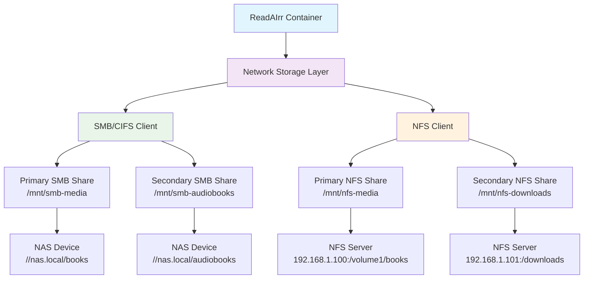

# ReadAIrr Docker Deployment Overview

This document provides comprehensive information about ReadAIrr's Docker deployment configurations, including all Docker services, images, volumes, and network storage capabilities.

## Table of Contents
- [Overview](#overview)
- [Docker Services](#docker-services)
- [Docker Images](#docker-images)
- [Environment Configuration](#environment-configuration)
- [Volume Management](#volume-management)
- [Network Storage](#network-storage)
- [Deployment Scenarios](#deployment-scenarios)
- [Health Checks & Monitoring](#health-checks--monitoring)
- [Troubleshooting](#troubleshooting)

## Overview

ReadAIrr provides multiple Docker deployment configurations to support various use cases:

- **Development Environment** (`docker-compose.dev.yml`) - Full development setup with network storage support
- **Simple Deployment** (`docker-compose.simple.yml`) - Lightweight setup for basic usage
- **Production-Ready** (multi-stage Dockerfiles) - Optimized builds for production deployment

### Key Features
- Multi-platform support (Linux/AMD64, Linux/ARM64)
- Network storage integration (SMB/CIFS, NFS)
- Persistent data volumes
- Health monitoring
- Resource management
- Security hardening

## Docker Services

### Development Services (`docker-compose.dev.yml`)

| Service | Image | Container | Ports | Restart Policy | Profiles |
|---------|-------|-----------|-------|----------------|----------|
| `readairr-dev` | `readairr-dev:latest` | `readairr-dev` | `8246:8246` | `unless-stopped` | - |
| `readairr-db` | `postgres:15-alpine` | `readairr-db-dev` | `5432:5432` | `unless-stopped` | `postgres` |

#### Main Application Service (`readairr-dev`)

| Configuration | Value | Description |
|---------------|--------|-------------|
| **Build Context** | `.` | Root directory |
| **Dockerfile** | `Dockerfile.dev` | Development-optimized build |
| **Privileged Mode** | `true` | Required for network storage mounting |
| **Capabilities** | `SYS_ADMIN` | File system mounting permissions |
| **Devices** | `/dev/fuse` | FUSE device access |
| **Security Options** | `apparmor:unconfined` | Required for network mounts |
| **Memory Limit** | `1G` | Maximum memory allocation |
| **CPU Limit** | `1.0` | Maximum CPU cores |
| **Memory Reservation** | `512M` | Reserved memory |
| **CPU Reservation** | `0.5` | Reserved CPU cores |

#### Database Service (`readairr-db`)

| Configuration | Value | Description |
|---------------|--------|-------------|
| **Database Type** | PostgreSQL 15 Alpine | Lightweight PostgreSQL |
| **Default Database** | `readairr` | Application database |
| **Default User** | `readairr` | Application user |
| **Encoding** | `UTF-8` | Character encoding |
| **Collation** | `C` | Default collation |
| **Health Check** | `pg_isready` | PostgreSQL readiness check |

### Simple Deployment Services (`docker-compose.simple.yml`)

| Service | Image | Container | Ports | Environment |
|---------|-------|-----------|-------|-------------|
| `readairr` | `readairr-local` | `readairr-local` | `8787:8787` | Development |

## Docker Images

### Available Docker Images

| Dockerfile | Base Image | Target | Runtime | Purpose |
|------------|------------|--------|---------|---------|
| `Dockerfile` | `mcr.microsoft.com/dotnet/runtime:6.0-alpine` | Production | .NET Runtime | Basic production deployment |
| `Dockerfile.dev` | `mcr.microsoft.com/dotnet/runtime:6.0-alpine` | Development | .NET Runtime | Development with network storage |
| `Dockerfile.build` | `mcr.microsoft.com/dotnet/aspnet:6.0-alpine` | Build | ASP.NET Runtime | Build with analysis disabled |
| `Dockerfile.complete` | `mcr.microsoft.com/dotnet/aspnet:6.0-alpine` | Complete | ASP.NET Runtime | Full-featured production |
| `Dockerfile.simple` | - | Simple | - | Lightweight local development |
| `Dockerfile.sdk` | `mcr.microsoft.com/dotnet/sdk:6.0-alpine` | SDK | .NET SDK | Development with full SDK |

### Image Comparison Matrix

| Feature | Dockerfile | Dockerfile.dev | Dockerfile.build | Dockerfile.complete |
|---------|------------|----------------|------------------|---------------------|
| **Size** | Small | Medium | Medium | Large |
| **Network Storage** | ❌ | ✅ | ❌ | ✅ |
| **Development Tools** | ❌ | ✅ | ❌ | ✅ |
| **Health Checks** | ✅ | ✅ | ✅ | ✅ |
| **Multi-stage Build** | ❌ | ❌ | ✅ | ✅ |
| **Production Ready** | ✅ | ❌ | ✅ | ✅ |
| **Analysis Disabled** | ❌ | ❌ | ✅ | ❌ |

### System Dependencies by Image

| Package | Dockerfile | Dockerfile.dev | Dockerfile.build | Dockerfile.complete |
|---------|------------|----------------|------------------|---------------------|
| `curl` | ✅ | ✅ | ✅ | ✅ |
| `ca-certificates` | ✅ | ✅ | ✅ | ✅ |
| `cifs-utils` | ❌ | ✅ | ✅ | ✅ |
| `nfs-utils` | ❌ | ✅ | ✅ | ✅ |
| `bash` | ❌ | ✅ | ✅ | ✅ |
| `jq` | ❌ | ✅ | ✅ | ✅ |
| `unzip` | ❌ | ❌ | ✅ | ✅ |
| `sudo` | ❌ | ✅ | ❌ | ❌ |
| `shadow` | ❌ | ❌ | ❌ | ✅ |

## Environment Configuration

### Core Application Variables

| Variable | Default | Description | Required |
|----------|---------|-------------|----------|
| `READAIRR_BRANCH` | `develop` | Application branch | ❌ |
| `READAIRR_LOG_LEVEL` | `info` | Logging level (debug, info, warn, error) | ❌ |
| `READAIRR_ANALYTICS_ENABLED` | `false` | Enable analytics collection | ❌ |
| `READAIRR_AUTH_REQUIRED` | `false` | Require authentication | ❌ |
| `READAIRR_API_KEY` | - | API key for authentication | ❌ |
| `XDG_CONFIG_HOME` | `/config` | Configuration directory | ✅ |

### Docker Configuration Variables

| Variable | Default | Description |
|----------|---------|-------------|
| `READAIRR_CONTAINER_NAME` | `readairr-dev` | Container name |
| `READAIRR_IMAGE_NAME` | `readairr-dev` | Image name |
| `READAIRR_PORT` | `8246` | Host port mapping |
| `READAIRR_NETWORK` | `readairr-network` | Docker network name |

### Network Storage Variables

| Category | Variable | Default | Description |
|----------|----------|---------|-------------|
| **Control** | `NETWORK_STORAGE_ENABLED` | `false` | Enable network storage mounting |
| **SMB Primary** | `SMB_SHARE_PATH` | - | SMB share path (e.g., `//nas.local/books`) |
| | `SMB_USERNAME` | - | SMB authentication username |
| | `SMB_PASSWORD` | - | SMB authentication password |
| | `SMB_DOMAIN` | - | SMB domain (optional) |
| | `SMB_VERSION` | `3.0` | SMB protocol version |
| | `SMB_MOUNT_POINT` | `/mnt/smb-media` | Mount point in container |
| **NFS Primary** | `NFS_SHARE_PATH` | - | NFS share path (e.g., `192.168.1.100:/volume1/books`) |
| | `NFS_OPTIONS` | `rw,hard,intr,rsize=8192,wsize=8192,timeo=14` | NFS mount options |
| | `NFS_MOUNT_POINT` | `/mnt/nfs-media` | Mount point in container |
| **SMB Secondary** | `SMB_SHARE_PATH_2` | - | Additional SMB share |
| | `SMB_MOUNT_POINT_2` | `/mnt/smb-audiobooks` | Additional SMB mount point |
| **NFS Secondary** | `NFS_SHARE_PATH_2` | - | Additional NFS share |
| | `NFS_MOUNT_POINT_2` | `/mnt/nfs-downloads` | Additional NFS mount point |

### Path Configuration Variables

| Variable | Default | Description |
|----------|---------|-------------|
| `READAIRR_CONFIG_PATH` | `./docker-data/config` | Host config directory |
| `READAIRR_DOWNLOADS_PATH` | `./docker-data/downloads` | Host downloads directory |
| `READAIRR_MEDIA_PATH` | `./docker-data/media` | Host media directory |
| `READAIRR_BACKUP_PATH` | `./docker-data/backups` | Host backup directory |

## Volume Management

### Persistent Volumes

| Container Path | Host Path | Purpose | Access |
|----------------|-----------|---------|---------|
| `/config` | `${READAIRR_CONFIG_PATH}` | Configuration and database | `rw` |
| `/downloads` | `${READAIRR_DOWNLOADS_PATH}` | Download staging area | `rw` |
| `/media` | `${READAIRR_MEDIA_PATH}` | Organized media library | `rw` |
| `/backups` | `${READAIRR_BACKUP_PATH}` | Application backups | `rw` |

### Development Volumes

| Container Path | Host Path | Purpose | Access |
|----------------|-----------|---------|---------|
| `/app/src` | `./src` | Backend source code | `ro` |
| `/app/frontend` | `./frontend` | Frontend source code | `ro` |

### Network Mount Points

| Container Path | Purpose | Network Type |
|----------------|---------|--------------|
| `/mnt/smb-media` | Primary SMB share | SMB/CIFS |
| `/mnt/nfs-media` | Primary NFS share | NFS |
| `/mnt/smb-audiobooks` | Secondary SMB share | SMB/CIFS |
| `/mnt/nfs-downloads` | Secondary NFS share | NFS |

### Named Volumes

| Volume Name | Driver | Purpose |
|-------------|--------|---------|
| `readairr-db-data` | `local` | PostgreSQL database storage |

## Network Storage

### Network Storage Architecture



### Mounting Process

The network storage mounting process follows this sequence:

1. **Container Startup**
   - Docker starts the ReadAIrr container
   - Entrypoint script (`docker-entrypoint.sh`) begins execution

2. **Environment Validation**
   - Check if `NETWORK_STORAGE_ENABLED=true`
   - Validate SMB and NFS configuration parameters
   - Verify network connectivity

3. **Mount Point Creation**
   - Create mount directories if they don't exist
   - Set appropriate permissions

4. **Network Share Mounting**
   - Mount SMB shares using `mount.cifs`
   - Mount NFS shares using `mount.nfs`
   - Apply mount options and credentials

5. **Verification**
   - Test mount accessibility
   - List active network mounts
   - Log mount status

### Mount Options

#### SMB Mount Options
```bash
# Standard SMB mount options
rw,uid=1000,gid=1000,iocharset=utf8,file_mode=0664,dir_mode=0775,vers=3.0

# High-performance SMB options
rw,uid=1000,gid=1000,iocharset=utf8,cache=strict,vers=3.1.1
```

#### NFS Mount Options
```bash
# Standard NFS mount options
rw,hard,intr,rsize=8192,wsize=8192,timeo=14

# High-performance NFS options
rw,hard,intr,rsize=32768,wsize=32768,timeo=14,proto=tcp
```

### Security Considerations

| Security Aspect | SMB/CIFS | NFS | Recommendation |
|------------------|----------|-----|----------------|
| **Authentication** | Username/Password | Host-based | Use dedicated service accounts |
| **Encryption** | SMB 3.0+ encryption | IPSec/Kerberos | Enable encryption in transit |
| **Permissions** | NTFS/file mode | Unix permissions | Use appropriate uid/gid mapping |
| **Network** | TCP 445 | TCP 2049 | Restrict to internal networks |
| **Credentials** | Environment/file | None required | Use credential files for sensitive data |

## Deployment Scenarios

### Scenario 1: Development Environment

**Use Case**: Local development with network storage access

**Configuration**:
```yaml
# docker-compose.dev.yml
services:
  readairr-dev:
    build:
      dockerfile: Dockerfile.dev
    privileged: true
    environment:
      - NETWORK_STORAGE_ENABLED=true
      - SMB_SHARE_PATH=//nas.local/books
      - SMB_USERNAME=devuser
      - SMB_PASSWORD=devpass
```

**Features**:
- ✅ Network storage support
- ✅ Live code reloading
- ✅ Debug logging
- ✅ Development tools
- ❌ Production optimization

### Scenario 2: Simple Local Deployment

**Use Case**: Basic ReadAIrr instance without network storage

**Configuration**:
```yaml
# docker-compose.simple.yml
services:
  readairr:
    build:
      dockerfile: Dockerfile.simple
    ports:
      - "8787:8787"
```

**Features**:
- ✅ Lightweight
- ✅ Fast startup
- ✅ Local storage only
- ❌ Network storage
- ❌ Advanced features

### Scenario 3: Production Deployment

**Use Case**: Production-ready deployment with PostgreSQL

**Configuration**:
```yaml
version: '3.8'
services:
  readairr:
    build:
      dockerfile: Dockerfile.complete
    restart: always
    environment:
      - READAIRR_DB_TYPE=postgresql
      - NETWORK_STORAGE_ENABLED=true
  
  readairr-db:
    image: postgres:15-alpine
    restart: always
```

**Features**:
- ✅ Production optimization
- ✅ External database
- ✅ Network storage
- ✅ Health monitoring
- ✅ Resource limits

### Scenario 4: Multi-NAS Integration

**Use Case**: Multiple network storage sources

**Configuration**:
```bash
# .env.local
NETWORK_STORAGE_ENABLED=true

# Primary media (Synology)
SMB_SHARE_PATH=//synology.local/books
SMB_MOUNT_POINT=/mnt/synology-books

# Downloads (QNAP)
NFS_SHARE_PATH=192.168.1.200:/downloads
NFS_MOUNT_POINT=/mnt/qnap-downloads

# Audiobooks (Windows Server)
SMB_SHARE_PATH_2=//windows-server/audiobooks
SMB_MOUNT_POINT_2=/mnt/windows-audiobooks
```

## Health Checks & Monitoring

### Application Health Check

All Docker images include health check configurations:

```dockerfile
HEALTHCHECK --interval=30s --timeout=10s --start-period=5s --retries=3 \
  CMD curl -f http://localhost:8246/api/v1/system/status || exit 1
```

| Parameter | Value | Description |
|-----------|-------|-------------|
| `interval` | `30s` | Check frequency |
| `timeout` | `10s` | Maximum check time |
| `start-period` | `5s` | Initial startup grace period |
| `retries` | `3` | Consecutive failures before unhealthy |

### Network Storage Health

The mounting scripts include health verification:

1. **Mount Status Check**: Verify mounts are active
2. **Access Test**: Test read/write permissions
3. **Connectivity**: Ping network hosts
4. **Space Check**: Monitor available storage

### Monitoring Integration

#### Container Monitoring
```bash
# Check container health
docker inspect readairr-dev --format='{{.State.Health.Status}}'

# Monitor container logs
docker-compose -f docker-compose.dev.yml logs -f readairr-dev

# Resource usage
docker stats readairr-dev
```

#### Network Storage Monitoring
```bash
# Check mounted shares
docker exec readairr-dev mount | grep -E "(cifs|nfs)"

# Test share accessibility
docker exec readairr-dev ls -la /mnt/smb-media

# Network connectivity
docker exec readairr-dev ping -c 3 nas.local
```

## Troubleshooting

### Common Issues and Solutions

#### Container Startup Issues

| Issue | Symptoms | Solution |
|-------|----------|----------|
| **Permission Denied** | Mount errors in logs | Check privileged mode and capabilities |
| **Network Unreachable** | Cannot reach NAS | Verify Docker network configuration |
| **Port Conflicts** | Application won't start | Check port mappings and conflicts |

#### Network Storage Issues

| Issue | Symptoms | Solution |
|-------|----------|----------|
| **SMB Authentication Failed** | Mount fails with auth error | Verify username/password, check domain |
| **NFS Permission Denied** | Cannot access NFS share | Check NFS export configuration and client IP |
| **Stale Mount** | I/O errors on network share | Remount shares or restart container |
| **Performance Issues** | Slow file operations | Optimize mount options, check network |

### Diagnostic Commands

#### Container Diagnostics
```bash
# Check container status
docker-compose -f docker-compose.dev.yml ps

# View detailed logs
docker-compose -f docker-compose.dev.yml logs --tail=50 readairr-dev

# Execute shell in container
docker-compose -f docker-compose.dev.yml exec readairr-dev bash

# Check container configuration
docker inspect readairr-dev
```

#### Network Storage Diagnostics
```bash
# Test network connectivity
docker exec readairr-dev ping -c 3 nas.local

# Check mount points
docker exec readairr-dev df -h | grep -E "(cifs|nfs)"

# Manual mount test
docker exec readairr-dev sudo mount -t cifs //nas.local/test /mnt/test

# Check SMB/NFS services
docker exec readairr-dev nmap -p 445,2049 nas.local
```

### Log Analysis

#### Application Logs
```bash
# ReadAIrr application logs
docker-compose logs readairr-dev | grep -E "(ERROR|WARN)"

# Database connection issues
docker-compose logs readairr-dev | grep -i database

# Network storage related logs
docker-compose logs readairr-dev | grep -i mount
```

#### System Logs
```bash
# Container system logs
docker exec readairr-dev dmesg | grep -E "(mount|cifs|nfs)"

# Network interface logs
docker exec readairr-dev ip addr show
```

## Best Practices

### Security
- Use dedicated service accounts for network storage
- Enable SMB encryption (version 3.0+)
- Restrict network access to internal networks only
- Store credentials in files rather than environment variables for production
- Regularly update base images and dependencies

### Performance
- Use local storage for temporary files and processing
- Configure appropriate mount options for your network
- Monitor network bandwidth usage
- Consider caching strategies for frequently accessed content

### Maintenance
- Regular container updates and rebuilds
- Monitor disk usage and clean up old containers/volumes
- Backup configuration and database regularly
- Test disaster recovery procedures

This comprehensive deployment overview provides all necessary information for deploying and managing ReadAIrr in various Docker environments, with particular attention to network storage integration capabilities.
